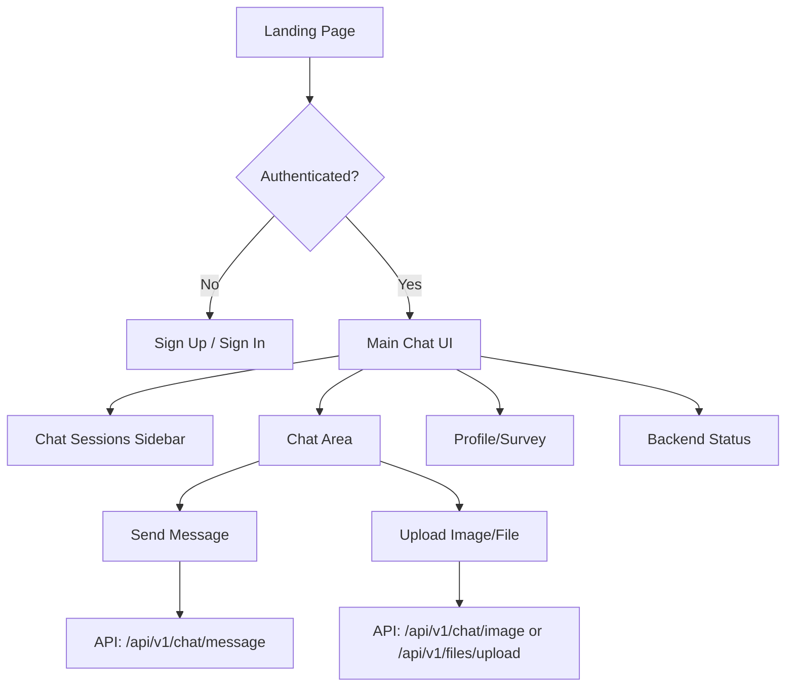
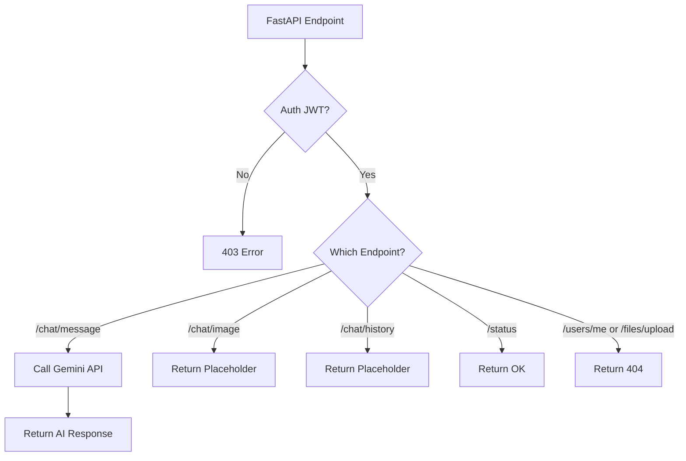

# 📚 fynqAI Documentation

> **Version:** 1.0.0  
> **Last Updated:** July 2024

---

## 🏆 Overview

**fynqAI** is a next-generation AI-powered learning platform that combines conversational AI, real-time chat, file uploads, and personalized learning. It leverages a modern frontend (React, Vite, TypeScript, Tailwind, Shadcn/UI), a robust backend (FastAPI, Django, Starlette), and a powerful BaaS (Supabase) for authentication, data, and storage. Google Gemini powers the AI chat experience.

---

## 🗂️ Project Structure

```
fynqAI/
├── README.md
├── fynq_documentation.md
├── app/
├── backend/
│   ├── asgi.py
│   ├── core/
│   │   ├── settings.py
│   │   └── ...
│   ├── main.py
│   ├── requirements.txt
│   └── ...
├── src/
│   ├── App.tsx
│   ├── main.tsx
│   ├── components/
│   ├── contexts/
│   ├── hooks/
│   ├── integrations/
│   │   └── supabase/
│   ├── lib/
│   ├── pages/
│   ├── services/
│   ├── types/
│   └── ...
├── supabase/
│   ├── config.toml
│   └── migrations/
└── ...
```

### **Key Directories**
- **backend/**: Python backend (FastAPI, Django, Starlette, Uvicorn)
- **src/**: Frontend (React, Vite, TypeScript, Tailwind, Shadcn/UI)
- **supabase/**: Supabase config and migrations
- **uploads/**: Uploaded files (if any)

---

## 🧑‍💻 User Flow (Frontend)

1. **Landing Page**: User is greeted with a beautiful, animated welcome and feature highlights.
2. **Authentication**: User can sign up or sign in using email/password (Supabase Auth). JWT is stored in localStorage.
3. **Main Chat Interface**:
   - **Sidebar**: Shows chat sessions (from Supabase), allows switching, creating, or deleting sessions.
   - **Chat Area**: User sends messages, uploads images/files, and receives AI responses.
   - **Backend Status**: Real-time indicator of backend health.
4. **Profile & Survey**: User can fill out a survey for personalized learning (stored in Supabase).
5. **File Uploads**: User can upload study materials (files stored in Supabase, metadata in DB).
6. **Premium/Upgrade**: UI for premium features (coming soon).

### **Frontend Data Flow**
- **Auth**: Supabase JS client manages auth state, session, and JWT.
- **Chat Sessions/Messages**: CRUD via Supabase client, cached in LocalForage for offline/fast access.
- **AI Chat**: User message sent to FastAPI endpoint with JWT; response displayed in chat.
- **File/Image Upload**: Sent to FastAPI endpoint (file upload placeholder, image upload placeholder).

---

## 🏗️ Backend Flow

### **ASGI App Structure**
- **Starlette** mounts:
  - **FastAPI** at `/api/v1` (AI, file, image, user endpoints)
  - **Django** at `/` (admin, static, ORM)

### **FastAPI Endpoints**
- **/api/v1/chat/message**: Receives message, calls Google Gemini, returns AI response.
- **/api/v1/chat/image**: Receives image + message, placeholder for future AI image processing.
- **/api/v1/chat/history**: Placeholder for chat history (not implemented).
- **/api/v1/status**: Health check endpoint (used by frontend for backend status).
- **/api/v1/users/me**: Placeholder for user info (not implemented).
- **/api/v1/files/upload**: Placeholder for file upload (not implemented).

### **Django**
- Used for admin, ORM, and static files. Not currently used for chat or user data (handled by Supabase).
- Database: SQLite (local dev), can be swapped for Postgres in production.

### **Supabase**
- Handles all chat session/message storage, user profiles, survey responses, file metadata, and credits.
- Auth: Issues JWTs for frontend, used for backend API calls.

---

## 🔌 API Endpoints — Status & Details

| Endpoint                  | Method | Auth | Status         | Description                                 |
|---------------------------|--------|------|---------------|---------------------------------------------|
| `/api/v1/chat/message`    | POST   | JWT  | ✅ Working     | Send message to Gemini AI, get response     |
| `/api/v1/chat/image`      | POST   | JWT  | ⚠️ Placeholder| Accepts image+message, not AI processed yet |
| `/api/v1/chat/history`    | GET    | JWT  | ❌ Not working | Not implemented, returns placeholder        |
| `/api/v1/status`          | GET    | None | ✅ Working     | Backend health check                        |
| `/api/v1/users/me`        | GET    | JWT  | ❌ Not working | Not implemented, returns 404                |
| `/api/v1/files/upload`    | POST   | JWT  | ❌ Not working | Not implemented, returns 404                |

### **Endpoint Implementation Details**
- **/api/v1/chat/message**
  - **Input**: `{ message: string, chat_id?: string }`
  - **Auth**: JWT (from Supabase) in `Authorization: Bearer <token>`
  - **Flow**: Calls Google Gemini API, returns `{ response: string }`
  - **Error Handling**: Returns 500 on Gemini/API error
- **/api/v1/chat/image**
  - **Input**: `multipart/form-data` with `image`, `message`, `chat_id`
  - **Flow**: Returns a placeholder response; no AI image processing yet
- **/api/v1/chat/history**
  - **Flow**: Returns `{ message: "Chat history endpoint - Not yet implemented" }`
- **/api/v1/status**
  - **Flow**: Returns `{ status: "ok" }` or similar
- **/api/v1/users/me**
  - **Flow**: Not implemented; frontend expects it for user info
- **/api/v1/files/upload**
  - **Flow**: Not implemented; frontend expects it for file upload

---

## 🧩 Implementation Details

### **Frontend**
- **React + Vite + TypeScript**: SPA, hooks-based, modular components
- **Tailwind CSS**: Custom design tokens, dark/light mode, animations
- **Shadcn/UI + Radix UI**: Accessible, composable UI primitives
- **Supabase JS**: Auth, real-time DB, storage
- **LocalForage**: Caches chat sessions/messages for offline/fast access
- **React Query**: Async state management for API calls
- **API Helper**: Centralized fetch logic with error handling and JWT injection
- **Optimistic UI**: Chat sessions/messages appear instantly before server confirmation
- **Theming**: CSS variables, smooth transitions, dark/light mode

### **Backend**
- **FastAPI**: Async REST API, CORS, JWT Bearer auth (stubbed, not validated)
- **Google Gemini**: LLM for chat, API key in `.env`
- **Django**: Admin, ORM, static files
- **Starlette**: ASGI router, mounts FastAPI and Django
- **Supabase**: Handles all chat/user/file data, auth, and storage
- **SQLite**: Local dev DB for Django

### **Supabase Schema (Key Tables)**
- **chat_sessions**: `{ id, title, created_at, updated_at, user_id }`
- **chat_messages**: `{ id, content, session_id, created_at, is_user }`
- **profiles**: `{ id, user_id, username, first_name, last_name }`
- **survey_responses**: `{ id, user_id, ... }`
- **uploaded_files**: `{ id, user_id, file_name, file_path, file_type }`
- **user_credits**: `{ id, user_id, credits_remaining, is_premium }`

---

## 🔄 Data & User Flow Diagrams

### **Frontend User Flow**


### **Backend Flow**


---

## 📝 Minute Details & Tips

- **JWT Auth**: JWT is issued by Supabase, stored in localStorage, sent to backend for protected endpoints.
- **Backend JWT Verification**: Currently a stub; needs real JWT validation for production.
- **Supabase Direct Access**: All chat data is managed directly from frontend to Supabase (not via backend).
- **Offline Support**: LocalForage caches sessions/messages for instant load and offline use.
- **Optimistic Updates**: UI updates before server confirmation for snappy UX.
- **Theming**: Custom CSS variables, dark/light mode, smooth transitions.
- **Component Library**: All UI built with accessible, composable primitives (Shadcn/UI, Radix UI).
- **Testing**: Add/modify tests in `backend/tests/` and `src/lib/api.test.ts`.
- **File/Image Upload**: UI supports uploads, backend endpoints are placeholders for future AI processing.
- **Django**: Used for admin and ORM, not for chat data (yet).
- **Google Gemini**: API key required, see `.env` setup.

---

## 🚦 Roadmap & TODOs

- [ ] Implement real JWT validation in backend
- [ ] Implement `/api/v1/chat/history` endpoint
- [ ] Implement `/api/v1/users/me` endpoint
- [ ] Implement `/api/v1/files/upload` endpoint
- [ ] Integrate Supabase data with backend for unified data flow
- [ ] Add analytics, gamification, and premium features
- [ ] Add more tests (backend & frontend)
- [ ] Add SSR/SSG for SEO

---

## 💬 Support & Questions

For questions, issues, or feature requests, please open an issue or contact the fynqAI team.

---

**Made with ❤️ by the fynqAI Team** 